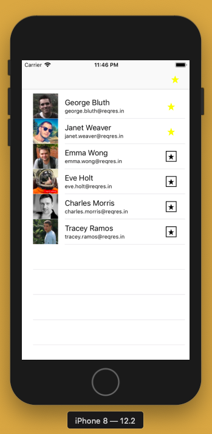
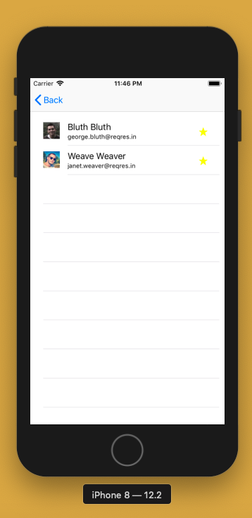
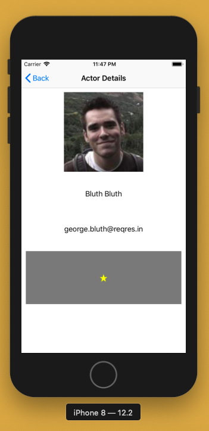

# SQLiteDemo

An app which gets the actors data using REST APIs, displays in a UITableView. We can mark them favourite/unfavourite. Based on this the data is carried forward. Used SQLite to store the data locally.

  
